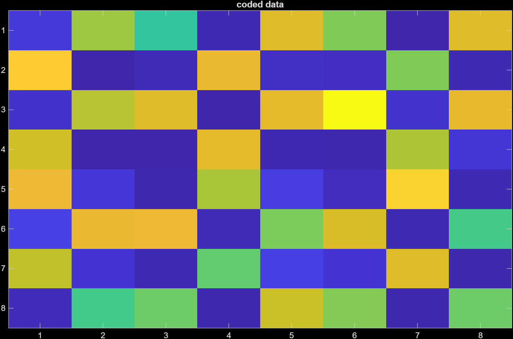

# Project Figures

Figures 1–10 are shown below with captions. All images are located in the `plots/` folder.

---

<figure>
  
  <figcaption><strong>Figure 1.</strong> [Replace with your caption for Figure 1]</figcaption>
</figure>

---

<figure>
  
  <figcaption><strong>Figure 2.</strong> [Replace with your caption for Figure 2]</figcaption>
</figure>

---

<figure>
  
  <figcaption><strong>Figure 3.</strong> [Replace with your caption for Figure 3]</figcaption>
</figure>

---

<figure>
  
  <figcaption><strong>Figure 4.</strong> [Replace with your caption for Figure 4]</figcaption>
</figure>

---

<figure>
  
  <figcaption><strong>Figure 5.</strong> [Replace with your caption for Figure 5]</figcaption>
</figure>

---

<figure>
  
  <figcaption><strong>Figure 6.</strong> [Replace with your caption for Figure 6]</figcaption>
</figure>

---

<figure>
  
  <figcaption><strong>Figure 7.</strong> [Replace with your caption for Figure 7]</figcaption>
</figure>

---

<figure>
  
  <figcaption><strong>Figure 8.</strong> [Replace with your caption for Figure 8]</figcaption>
</figure>

---

<figure>
  
  <figcaption><strong>Figure 9.</strong> [Replace with your caption for Figure 9]</figcaption>
</figure>

---

<figure>
  
  <figcaption><strong>Figure 10.</strong> [Replace with your caption for Figure 10]</figcaption>
</figure>
