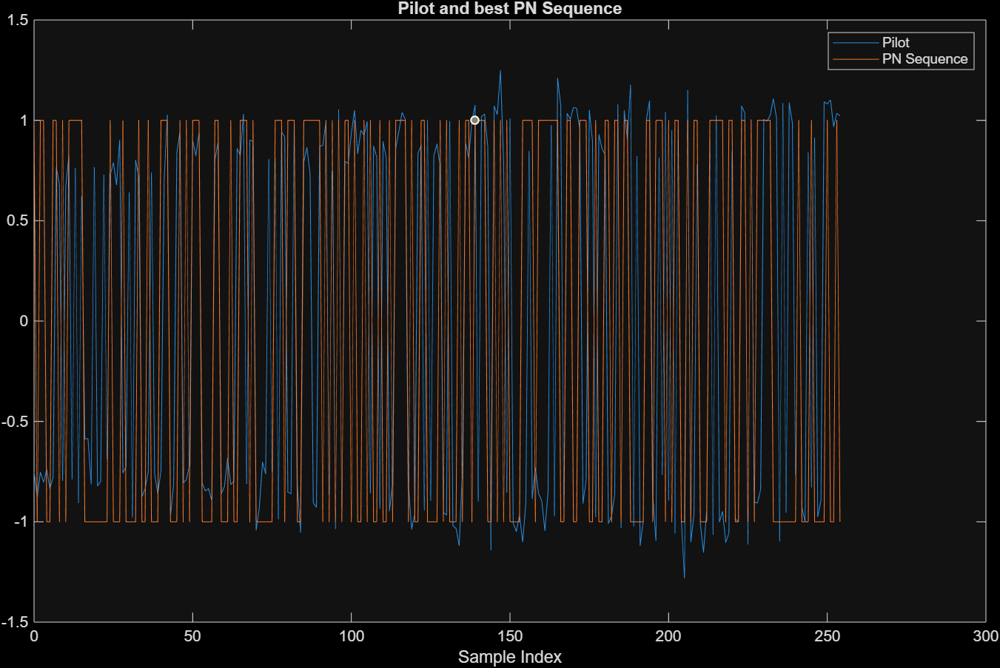

# CDMA Decoding

Step-by-step visuals from filtering and frame sync through Walsh decoding, phase correction, and frequency-offset estimation.

---

<figure>
  
  <figcaption><strong>Figure 1.</strong> Magnitude of the RCOS-filtered, 4×-downsampled received signal; red marker indicates the detected frame start using a |rcvd_filt| &gt; 0.95 threshold.</figcaption>
</figure>

---

<figure>
  
  <figcaption><strong>Figure 2.</strong> Pilot frame overlaid with the best-matching PN sequence (BPSK-modulated m-sequence) selected via maximum correlation, confirming the transmitter LFSR initial state.</figcaption>
</figure>

---

<figure>
  
  <figcaption><strong>Figure 3.</strong> Denoised frames after division by the PN sequence; pilot and data structure are visible across full 255-chip frames before cropping.</figcaption>
</figure>

---

<figure>
  
  <figcaption><strong>Figure 4.</strong> Denoised frames cropped to 192 chips (3 × 64-chip characters), removing trailing padding for downstream decoding.</figcaption>
</figure>

---

<figure>
  
  <figcaption><strong>Figure 5.</strong> Second frame (real part): full 192-chip sequence, first 64-chip character segment, and its first 8-chip row highlighted—setup for Walsh decoding.</figcaption>
</figure>

---

<figure>
  
  <figcaption><strong>Figure 6.</strong> Magnitude of the coded 8×8 chip block <em>c</em> for one character prior to Walsh despreading.</figcaption>
</figure>

---

<figure>
  
  <figcaption><strong>Figure 7.</strong> Walsh-decoded matrix <em>x = c' · H</em>: pilot (column 1) and data channel (column 6) are clearly separated after despreading.</figcaption>
</figure>

---

<figure>
  
  <figcaption><strong>Figure 8.</strong> Constellation of decoded symbols before phase correction (“rotated data”); a common phase rotation is evident from residual frequency/phase offset.</figcaption>
</figure>

---

<figure>
  
  <figcaption><strong>Figure 9.</strong> Constellation after de-rotation using the pilot reference (<em>x / x(:,1)</em>), realigned for BPSK demapping of the data channel.</figcaption>
</figure>

---

<figure>
  
  <figcaption><strong>Figure 10.</strong> Unwrapped average phase across frames with linear fit; the slope/(2π·<em>Tf</em>) provides the estimated constant frequency offset in Hz.</figcaption>
</figure>
